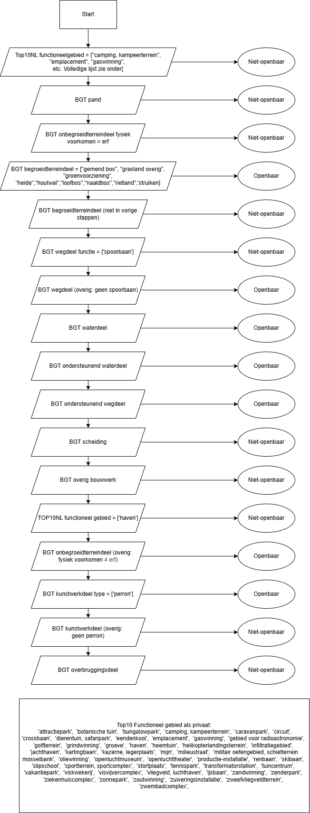

## Version: 0.1.0

# publicspace beschrijving

publicspace is een tool die het landschap opdeelt in openbare ("PUBLIC") en niet-openbare ("PRIVATE") ruimte, gebaseerd op openbaar beschikbare data in Nederland.
Deze tool werd opgesteld in opdracht van de Provincie Zeeland met als doel het maken van groenkaarten in de openbare ruimte,
Het uitgangspunt van deze tool is het aanduiden van het openbaar toegankelijk buitenterrein. Dit zegt dus niets over eigenaarschap of beheer. Daarnaast wordt niet 
gekeken naar de binnenruimte (bv. gemeentehuis, openbaar zwembad). De tool volgt een algemene methode die hieronder staat beschreven. Uitzonderingen op deze methode, missende of foutieve data kan leiden tot fouten in de uitvoer.

- Auteur: Emiel Verstegen
- Email: emiel.verstegen@rhdhv.com

- Reviewer: Julie Berta

# Gebruikte datasets
Er wordt gebruik gemaakt van openbaar beschikbare geodatasets die informatie bevatten over de fysieke leefomgeving in Nederland. Dit zijn de BGT en de Top10NL. 

De BGT is de "Basisregistratie Grootschalige Topografie" van de Nederlandse overheid. Hierin staan gebouwen, wegen, waterlopen, groen, terreinen en spoorlijnen vastgesteld.
De kaart is op 20 cm nauwkeurig. De bronhouders van de BGT zijn Ministeries (LNV en defensie), RWS, provincies, waterschappen, gemeenten en ProRail.

De Top10NL kaart is een onderdeel van de "Basisregistratie Topografie" (BRT) van de Nederlandse overheid. De Top10NL bevat de meest gedetailleerde topografische data. 
De bronhouder van deze kaart is het Ministerie van BZK. Over het algemeen is de BGT kaart meer gedetailleerd (meer bronhouders), maar de Top10NL kaart biedt meer inzicht in de functie van gebieden.

Beide datasets worden automatisch gedownload aan de hand van een opgegeven polygon.

# Methode
Er wordt gestart vanuit een lege kaart die in elke stap aangevuld wordt met polygonen uit een openbare dataset. In de datasets staan de functies van de terreinen.
Voor elke functie is, in samenspraak met de Provincie Zeeland, bepaald of het van openbare ("PUBLIC") of niet-openbare ("PRIVATE") categorie is. 
Hierbij werd niet gekeken naar eigenaarschap of wie de ruimte beheert, maar of het terrein openbaar toegankelijk is, bijvoorbeeld voor een wandeling met de hond.

Polygonen die in een eerste stap in een bepaalde functie en dus ook openbaar/privaat categorie worden ingedeeld, worden vastgezet in deze categorie. Deze kunnen dus in volgende stappen niet meer wijzigen. 
De volgorde van het aanwijzen van functie en categorie is daarom belangrijk. 
Bijvoorbeeld een kampeerterrein wordt in de eerste stap uit de databron Top10NL_functioneelgebied gehaald en als niet-openbaar bestempeld. 
Als de wegen binnen de camping in het BGT staan als wegdeel (openbaar), blijft het kampeerterrein toch "niet-openbaar" aangezien dat in een eerdere stap werd gedefinieerd.
Over de volgorde van de stappen werd dan ook goed nagedacht en er werden verschillende checks uitgevoerd door de provincie en gemeenten binnen de provincie met gebiedskennis om het stappenplan te verbeteren. 

Het gevolgde stappenplan werd vertaald in een overzichtelijk stroomdiagram. Dit geeft aan in welke volgorde de terreinen worden aangemaakt op de kaart en ingedeeld in de openbare of niet-openbare categorie.



# Known issues
De openbare data worden bij het runnen van dit script opnieuw ingeladen, maar dit betekent niet dat de meest actuele situatie weergegeven wordt. 
Recente ontwikkelingen die nog niet aangepast werden in de BGT, zullen bijgevolg niet aangepast zijn in de resultaten van dit script.

Voor alle resultaten geldt dat de betrouwbaarheid sterk afhankelijk is van de resolutie en correctheid van de openbare databronnen. 
Bovendien is bij de BGT mogelijk dat verschillende bronhouders een bepaalde functienaam op een andere manier interpreteren en aan verschillende gebiedstypen toewijzen waardoor een inconsistentie ontstaat.
Enkele zaken die opvielen bij de checks door de Provincie Zeeland en gemeenten:
- Natuurgebieden (bv. bij delen van de kop van Schouwen) worden soms gelabeld als "agrarisch grasland" in de BGT begroeid terreindeel. Deze gebieden worden dan ingedeeld in de niet-openbare categorie terwijl zeg
wel openbaar toegankelijk zijn in de realiteit.
- Sommige gebieden worden geclassificeerd als 'duin' (privaat) en andere als 'loofbos' (publiek), terwijl op de luchtfoto deze gebieden er heel gelijkwaardig uitzien (bv. kop van Schouwen).
- Parkeerterreinen, bijvoorbeeld bij winkels en winkelcentra, worden op verschillende manieren geclassificeerd in de BGT. Soms worden ze bestempeld als wegdeel (openbaar) en op andere plaatsen als onbegroeide terreindeel:erf (niet-openbaar).
Dit heeft mogelijks ook te maken met wie de parkeerterreinen beheert. In principe zijn alle parkeerterreinen zonder slagboom openbaar toegankelijk (minstens voor voetgangers).
- Militaire domeinen worden soms niet herkend in de BGT (begroeid terreindeel: groenvoorziening). Een voorbeeld hiervan is het Munitiecomplex aan de Rammekensweg in Ritthem.
- Brandgangen staan vaak niet ingetekend in de brondata aangezien ze over kavels heen liggen. Dit gaat echter over een beperkt oppervlak met weinig invloed.
- Wegens verschillende bronhouders (waterschap en gemeente) worden enkele delen van de fiets- en voetpaden op de waterkeringen bij Panta Rhei in Vlissingen als duin gelabeld in de BGT. Andere delen worden (correct) als wegvak gelabeld.


# Gebruik

In het bestand \`notebooks/main.py\` staat een voorbeeld hoe de analyse te starten. In essentie zijn de onderstaande regels van belang:

```{python
from publicspace.publicspace import PublicSpace
from publicspace.settings import BGT_LAYERS, TOP10NL_LAYERS

aoi = gpd.read_file('pad/naar/analysegebied.shp')           #shapefile, geopackage, etc.
bgt_path = 'pad/naar/bgt/'                                  #een map, geen bestand
top10nl_path = 'pad/naar/top10nl/'                          #een map, geen bestand
export_path = 'pad/voor/uitvoer.gpkg'                       # weg te schrijven bestand                           
export_aggregate_path = 'pad/voor/uitvoer_aggregate.gpkg'   # weg te schrijven bestand voor geaggregeerde uitvoer


ps = PublicSpace(aoi=aoi,
                 bgt_path=bgt_path,
                 bgt_layers=BGT_LAYERS,
                 bgt_download=True,
                 top10nl_path=top10nl_path,
                 top10nl_layers=TOP10NL_LAYERS,
                 top10nl_download=True,
                 )

ps.export(export_path)
ps.export_aggregate(export_aggregate_path)
```